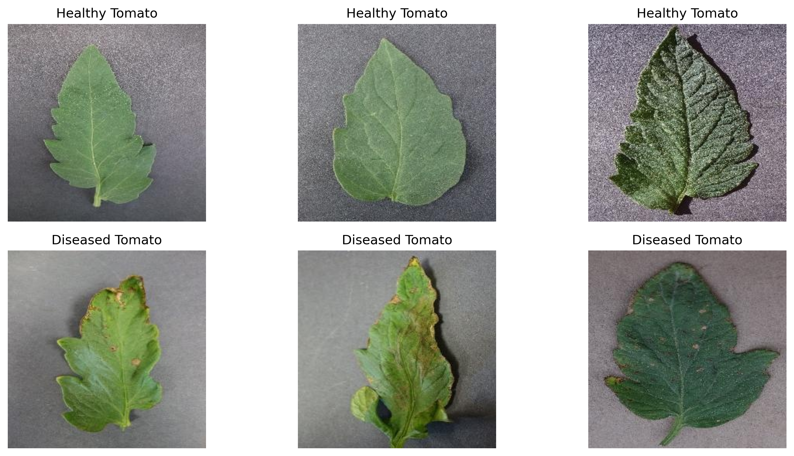
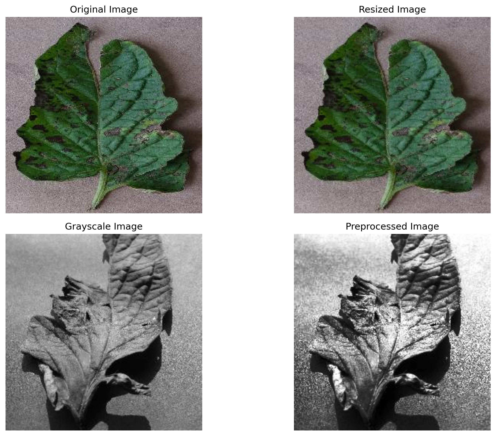
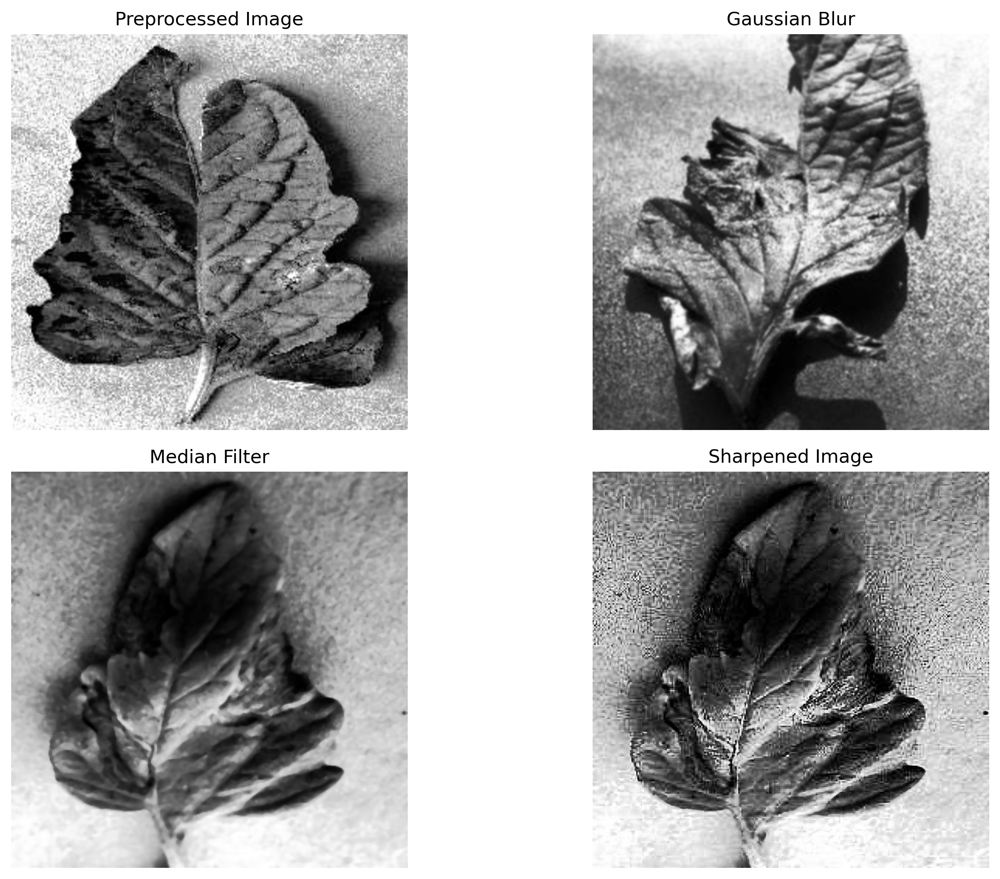
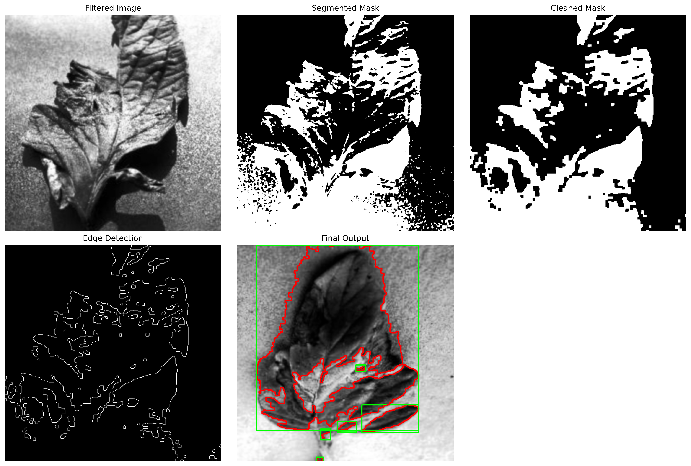

# Tomato Leaf Disease Spot Detection Using Image Processing

## Project Overview

This project detects suspected disease spots on tomato leaf images using classical image processing techniques. The system does not use any machine learning model or deployment. It processes tomato leaf images and highlights suspected diseased regions using preprocessing, filtering, segmentation, edge detection, and contour detection.

## Project Aim

The aim of this project is to detect and highlight visible disease-like spots on tomato leaves using image processing only.

## Problem Statement

Tomato leaf diseases often appear as dark, brown, or damaged spots on the leaf surface. Manual detection depends on human observation and may take time. This project uses image processing techniques to automatically detect and highlight suspected diseased regions.

## Tools Used

- Python
- Google Colab
- OpenCV
- NumPy
- Matplotlib
- Google Drive
- GitHub

## Dataset

The dataset contains tomato leaf images organized into two categories:

- Healthy_Tomato
- Diseased_Tomato

Link : https://www.kaggle.com/datasets/kaustubhb999/tomatoleaf

## Methodology

The project follows these steps:

1. Dataset Collection
2. Image Preprocessing
3. Image Filtering
4. Segmentation
5. Edge Detection
6. Contour Detection
7. Final Output Generation


## Image Processing Pipeline

```text
Input Tomato Leaf Image
        ↓
Preprocessing
        ↓
Filtering
        ↓
Segmentation
        ↓
Edge Detection
        ↓
Contour Detection
        ↓
Final Output
```

## Sample Results

### Dataset Samples


### Preprocessing Result


### Filtering Result


### Segmentation and Edge Detection Result

